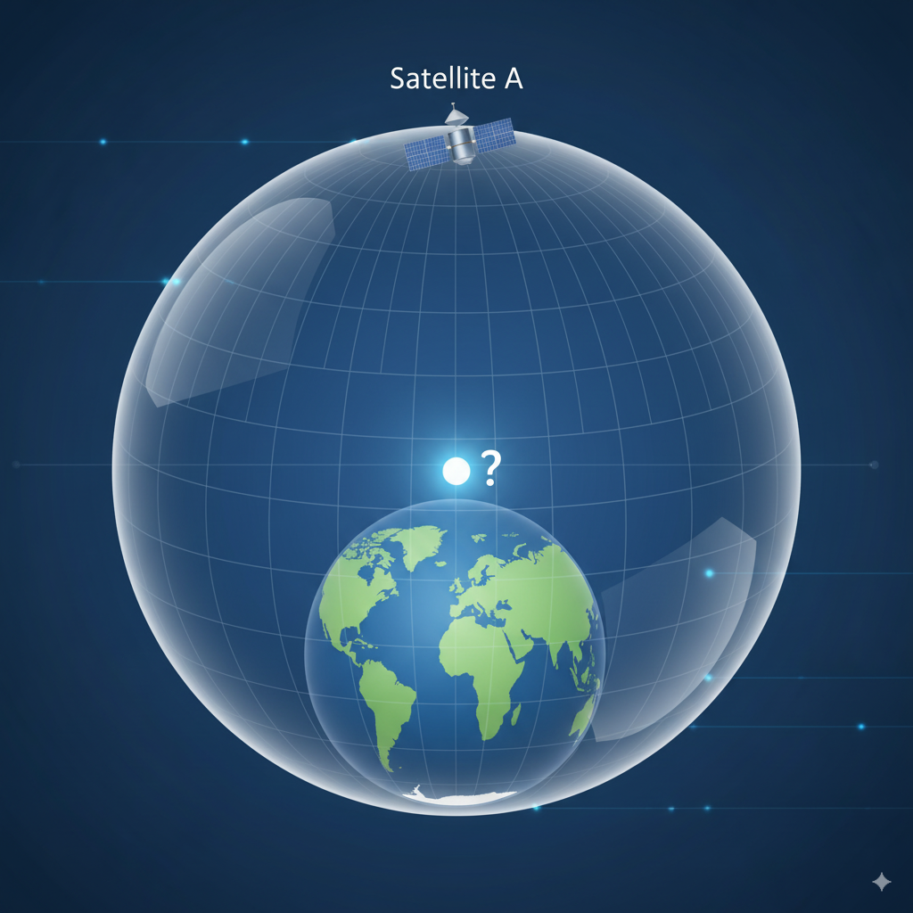
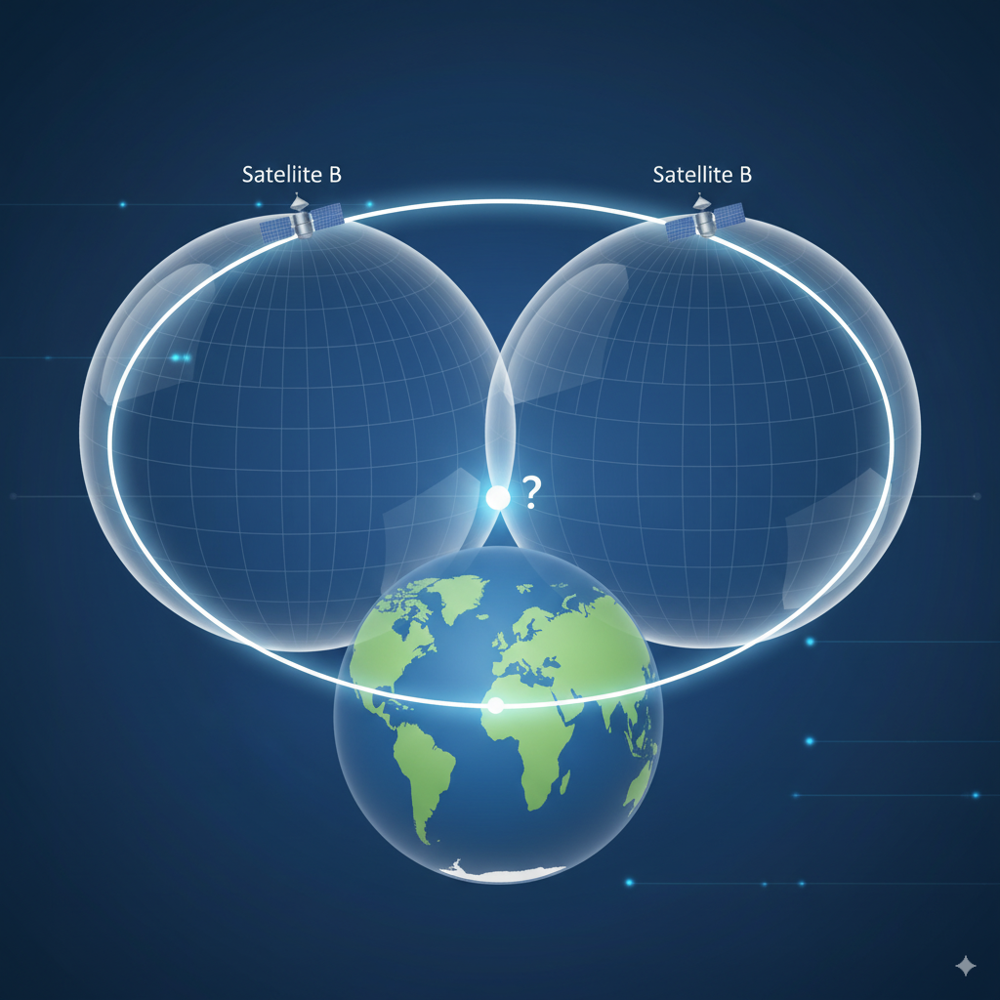
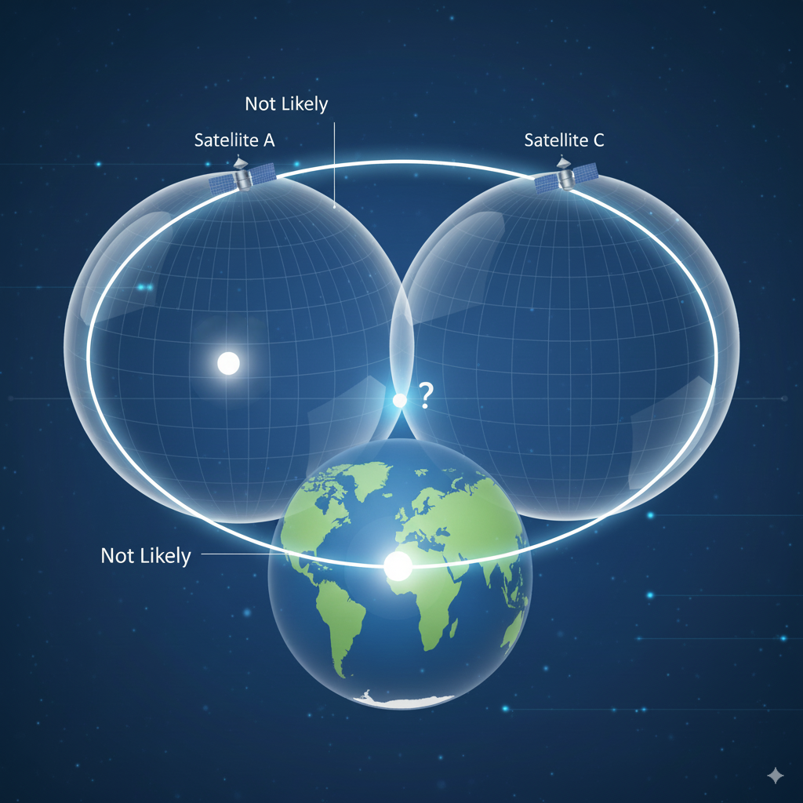

# The Clockwork Constellation: How GPS Uses Time to Find You

## How a Constellation of Clocks in the Sky Can Pinpoint Your Exact Location

Have you ever stopped to marvel at the magic of your phone’s map? You tap a button, and within seconds, a little blue dot appears, telling you exactly where you are on this vast planet. The technology behind this—the Global Positioning System (GPS)—feels like pure wizardry.

But it’s not magic. It’s one of the most elegant and brilliant applications of physics and engineering ever conceived. And at its heart, it all boils down to one surprisingly simple concept: **time**.

Seriously. It’s not about mapping or cell phone towers or witchcraft. It’s about clocks. Incredibly precise, atomic clocks hurtling through space, having a constant conversation with your phone. Let's unravel how this works.

### The Simple Explanation: A Cosmic Game of "You Are Here"

Imagine you’re standing somewhere in the world, completely lost. A friendly satellite in the sky sends you a message:
> "Hello! This is Satellite A. This message was sent at exactly 12:00:00.000000000 PM. The time now is 12:00:00.100000000 PM."

You have a super-accurate watch (synchronized with the satellite's clock). You see it took 0.1 seconds for the message to travel from the satellite to you. You know radio waves travel at the speed of light (which is *really* fast). So, you can calculate the distance: **Speed of Light × Time = Distance**.

You now know you are *somewhere* on a giant, imaginary sphere that has Satellite A at its center, with a radius exactly equal to that distance.

But that's not very helpful. You could be anywhere on that entire sphere. So, a second satellite, Satellite B, chimes in with its own timestamp. You calculate your distance from it. Now you have two spheres. These two spheres intersect in a perfect circle. You're somewhere on that circle. Better, but still not a precise location.

Finally, a third satellite, Satellite C, sends its signal. You calculate your distance from it, creating a third sphere. These three spheres don't all intersect in many places. In fact, they intersect at only **two points**. One of these points is usually somewhere out in space (not very likely), and the other is a single, precise point on the surface of the Earth.

**That's your location.** That’s the fundamental "trilateration" concept. Your GPS receiver is constantly doing this with not three, but four or more satellites to get an incredibly accurate fix. Tracking your location is just doing this calculation over and over again, very quickly, to see how that point moves over time.

But wait. There's a catch. A *massive* catch. This entire system relies on the clocks in the satellites and the clock in your phone being perfectly synchronized. A timing error of just a millionth of a second would result in a location error of over 300 meters. The atomic clocks on the satellites *are* that precise, but the cheap clock in your phone isn't. So how does it work?

This is the final, brilliant piece of the puzzle. Your phone's clock is *not* perfectly synced. It's slightly wrong. This timing error affects the distance calculation to *every single satellite* equally. So, the GPS system cleverly uses a **fourth satellite**. By processing the signals from four satellites, the GPS receiver can mathematically solve for four things simultaneously: your position in 3D space (latitude, longitude, altitude) **and** the exact error in your own internal clock. It calculates your location *and* corrects its own time in the process.

So, to summarize simply: GPS is a system that measures the time it takes for a signal to travel from a satellite to your receiver. By doing this with multiple satellites, it can triangulate your exact position on the globe and even keep its own cheap clock accurate to within nanoseconds.

## The Deeper Dive: Relativity, Corrections, and Real-World Engineering

The simple "spheres" explanation is the core, but the real-world system is a masterpiece of engineering that must account for some mind-bending physics.

**The Cast of Characters:**
*   **The Space Segment:** This is the constellation. 24+ operational satellites (with spares) orbiting about 20,000 km above the Earth, spread across six orbital planes. This ensures that from almost anywhere on Earth, at least four satellites are always "visible" in the sky.
*   **The Control Segment:** A global network of ground stations that constantly monitor the satellites. They track their exact orbits (because they drift slightly due to solar radiation and the moon's gravity), monitor the health of their atomic clocks, and upload precise correction data back to the satellites. This "ephemeris" and "clock correction" data is then included in the signal the satellites broadcast.
*   **The User Segment:** That's you and your GPS receiver (in your phone, car, or watch).

**The Signal Itself:**
The signal from each satellite isn't just a simple "ping." It's a complex radio wave containing a **pseudorandom code** (a unique, predictable digital pattern for each satellite) and the crucial **navigation message**. The navigation message contains the satellite's precise orbital location (its "ephemeris"), the health of its systems, and the all-important timestamp from its atomic clock.

Your receiver generates an identical copy of each satellite's pseudorandom code. By measuring how much it has to shift its own internal code to match the code received from the satellite, it can calculate the exact time delay of the signal's journey. This is a much more robust method than just listening for a simple timestamp.

**Overcoming Natural Hurdles:**
The system must correct for several errors that would otherwise make it useless:
*   **Atmospheric Delay:** The signal slows down slightly as it passes through the ionosphere and troposphere. The system uses dual frequencies and models to correct for this.
*   **Relativistic Effects:** This is where it gets truly fascinating. Einstein's theories of relativity are not abstract concepts here; they are mandatory corrections without which GPS would fail within minutes.
    *   **Special Relativity:** Because the satellites are moving at about 14,000 km/h relative to us on the ground, their clocks appear to run slower from our perspective.
    *   **General Relativity:** Because they are in a weaker gravitational field (further from Earth's mass), their clocks appear to run faster from our perspective.
    These two effects don't cancel each other out. The net result is that the satellites' clocks run faster than clocks on the ground by about 38 microseconds per day. That may seem tiny, but without correction, it would cause a location drift of over 10 km *per day*. Engineers brilliantly account for this by building the satellites' clocks to run slightly slower than the correct frequency *before* launch, so that once in orbit, they tick at the exact right rate from our Earth-bound perspective.

So, the simple act of finding your location is actually a continuous, global dance of ultra-precise timekeeping, orbital mechanics, atmospheric science, and relativistic physics, all seamlessly integrated to put that little blue dot on your map.

## The Mathematical Core: The Brutal Beauty of the Equations

For those who want to see the gears turning, here is the raw mathematical engine of GPS. It all reduces to solving a system of equations.

We have four unknowns:
*   The user's position: **(x, y, z)**
*   The user's clock bias (error): **b** (expressed as a distance, where `b = c * Δt`, with `c` being the speed of light and `Δt` the time error)

For each satellite *i*, we have a **pseudorange** (ρ_i), which is the measured distance based on the corrupted receiver clock time. The *true* geometric range is `√( (x - x_i)² + (y - y_i)² + (z - z_i)² )`.

The pseudorange is this true range plus the error introduced by the user's clock bias:
**ρ_i = √( (x - x_i)² + (y - y_i)² + (z - z_i)² ) + b**

We know:
*   **ρ_i** (measured from the signal time shift)
*   **(x_i, y_i, z_i)** (the satellite's position from the ephemeris data in the navigation message)

We need to solve for:
*   **(x, y, z, b)**

Since this is a nonlinear equation (due to the square root), we solve it using an iterative method like **Newton-Raphson**. We start with an initial guess for the user's position **(x₀, y₀, z₀)** and clock bias **b₀**. We then linearize the equation by taking the partial derivatives, which form the design matrix.

The linearized equation for each satellite is:
**Δρ_i ≈ ( (x₀ - x_i)/r_i ) * Δx + ( (y₀ - y_i)/r_i ) * Δy + ( (z₀ - z_i)/r_i ) * Δz + Δb**

Where:
*   **Δρ_i = ρ_i(measured) - ρ_i(calculated)** (the difference between the measured pseudorange and the pseudorange calculated from our initial guess)
*   **r_i = √( (x₀ - x_i)² + (y₀ - y_i)² + (z₀ - z_i)² )** (the estimated range to satellite *i*)
*   **( (x₀ - x_i)/r_i, (y₀ - y_i)/r_i, (z₀ - z_i)/r_i )** are the direction cosines—the components of the unit vector pointing from the initial guess to the satellite.
*   **(Δx, Δy, Δz, Δb)** are the corrections we need to apply to our initial guess.

With four satellites, we can set up a system of four equations:

`[ Δρ₁ ]   [ α₁₁  α₁₂  α₁₃  1 ]   [ Δx ]`
`[ Δρ₂ ] = [ α₂₁  α₂₂  α₂₃  1 ] * [ Δy ]`
`[ Δρ₃ ]   [ α₃₁  α₃₂  α₃₃  1 ]   [ Δz ]`
`[ Δρ₄ ]   [ α₄₁  α₄₂  α₄₃  1 ]   [ Δb ]`

Where **α_ij** are the direction cosines for each satellite.

This is written in matrix form as: **Δρ = H * Δx**

We solve for the correction vector: **Δx = (Hᵀ * H)⁻¹ * Hᵀ * Δρ**

We then update our initial guess: **x₁ = x₀ + Δx, y₁ = y₀ + Δy, z₁ = z₀ + Δz, b₁ = b₀ + Δb**

This process is repeated until the corrections **(Δx, Δy, Δz, Δb)** are smaller than a predetermined threshold. The result is the user's precise coordinates and the exact error of their internal clock.

This mathematical operation, running on a tiny chip in your phone, is what reconciles the signals from multiple atomic clocks in space to answer the ancient human question: "Where am I?" And it does it by fundamentally being the world's most expensive and accurate timekeeping service.
